# Terminal

# Table of Contents

- [Terminal](#terminal)
- [Table of Contents](#table-of-contents)
- [Step 1: Install Windows Terminal](#step-1-install-windows-terminal)
- [Step 2: Install PowerShell](#step-2-install-powershell)
- [Step 3: Configure Windows Terminal](#step-3-configure-windows-terminal)
- [Step 4: Install NerdFonts](#step-4-install-nerdfonts)
- [Step 5: Install Oh My Posh](#step-5-install-oh-my-posh)

# Step 1: Install Windows Terminal

1. Navigate to the Microsoft Store on a computer with a Windows OS.

    

2. Search for `Windows Terminal` and install.

    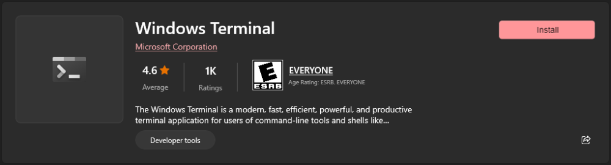

# Step 2: Install PowerShell

1. Navigate to the Microsoft Store on a computer with a Windows OS.

    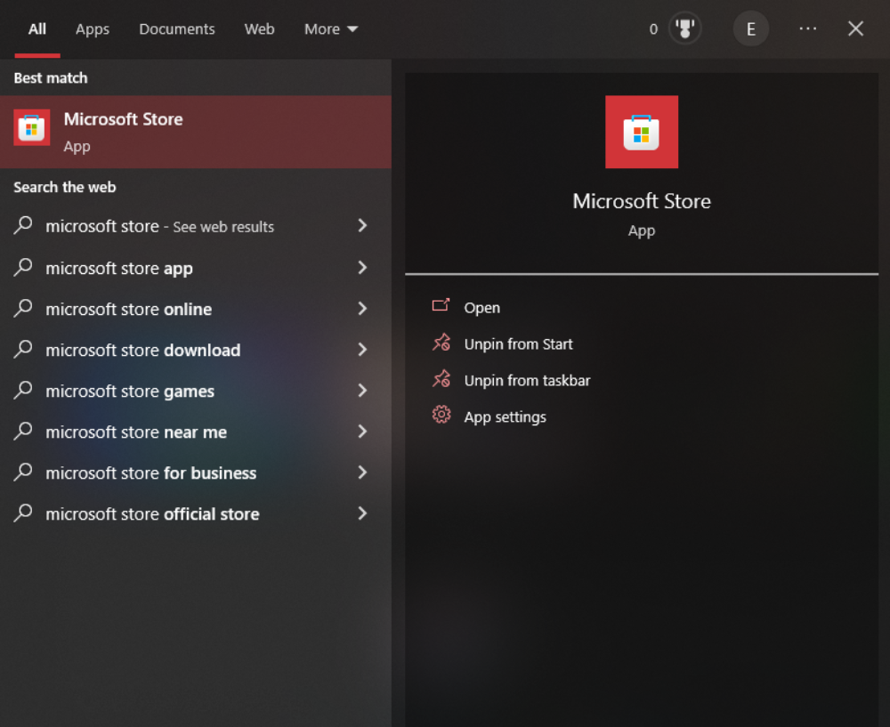

2. Search for `PowerShell` and install.

    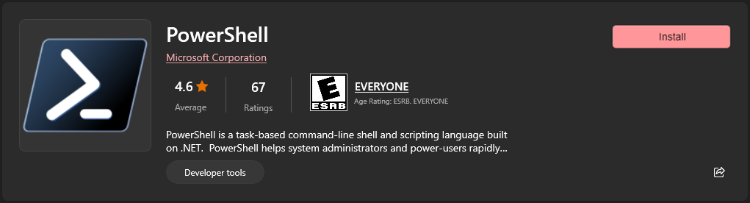

# Step 3: Configure Windows Terminal

1. Open `Windows Terminal`.

    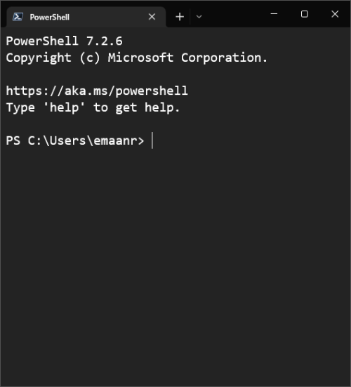

1. Navigate to `Settings`.

    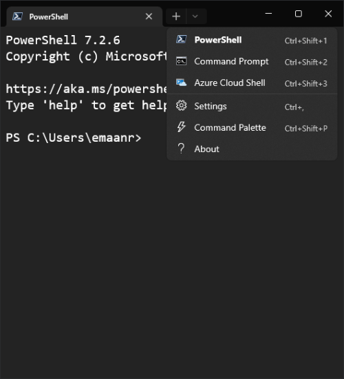

3. Set `PowerShell` as the Default Profile.

    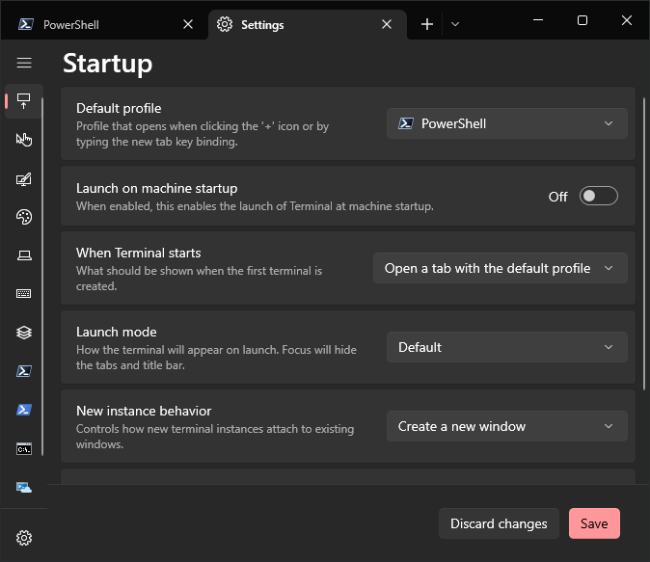

4. Select the `Settings Cog` in the bottom left hand corner to open the `settings.json` file for `Windows Terminal`.

    

5. Replace the contents of the `settings.json` opened in the previous step with the repository file contents found at `terminal/Windows Terminal/settings.json`.

6. Configure further as desired.

> Notes:
> - The file in the repository is the final version of the file after all steps are complete.
> - As of this step, `Windows Terminal` will not be able to find the NerdFont `Caskaydia Cove NF` which will throw a warning every time `Windows Terminal` is opened.
>
> 

>   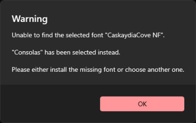
> 

>
>> More on `Caskaydia Cove NF`:
>> - This font is needed in order for `Oh My Posh` to work correctly (includes some special characters).
>> - If you don't want `Oh My Posh`, simply change the `Caskaydia Cove NF` font to some other font that exists on the machine already.
>> - This can be done in the Windows OS Font Settings.
>> - It seems that `Windows Terminal` defaults to the font `Consolas`.
>
> In order to remove this warning, install `CaskaydiaCove NF` in the next step.

# Step 4: Install NerdFonts

1. Navigate to the [`NerdFonts`](https://www.nerdfonts.com) website.

    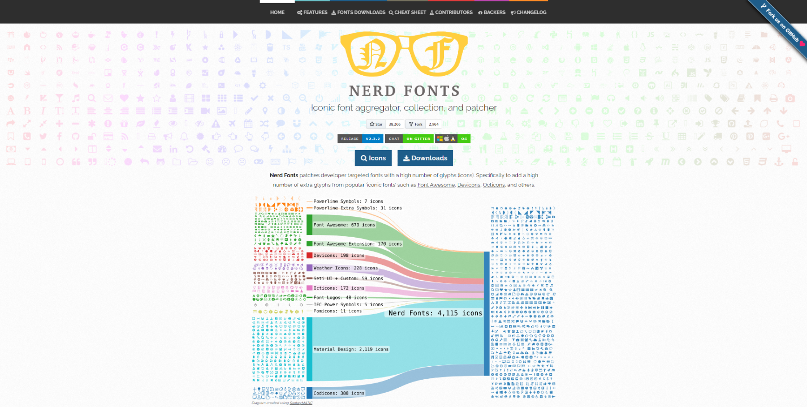

2. Click on [`Download`](https://www.nerdfonts.com/font-downloads) button.

    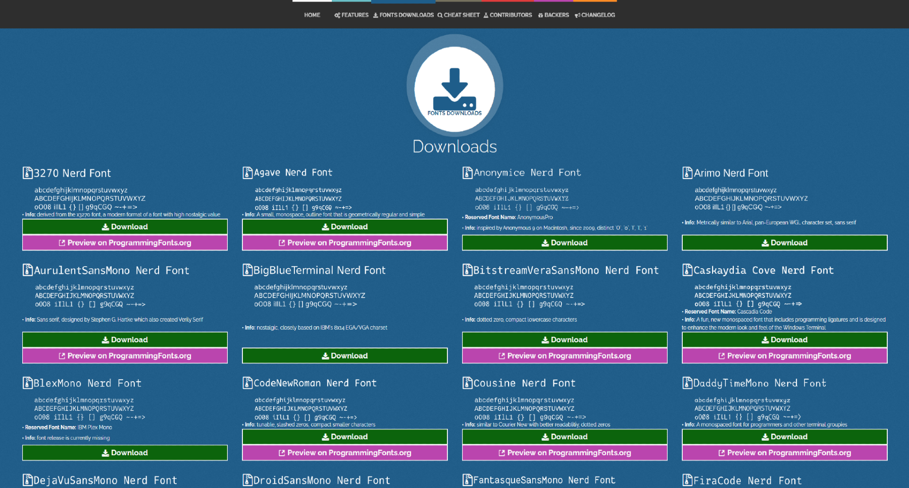

3. Save the `Zip Folder` anywhere (won't need it later).

    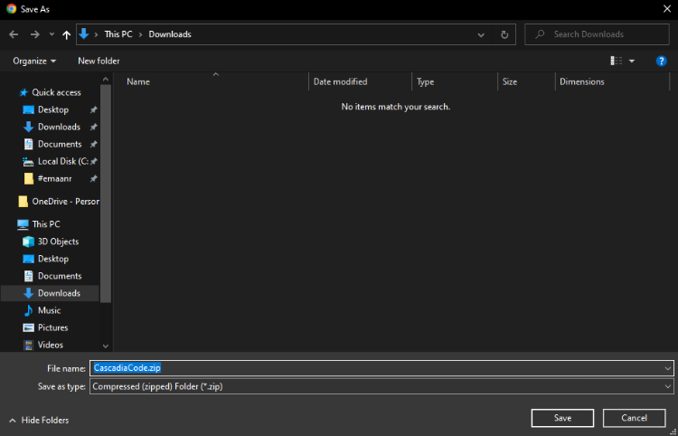

4. Open `Font Settings`.

    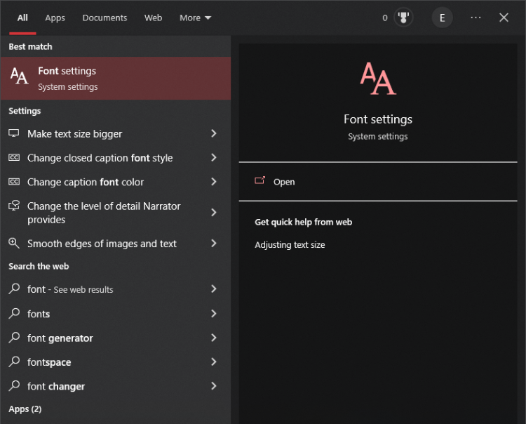

5. Extract the zip file and open the `Cascadia Code` folder.

    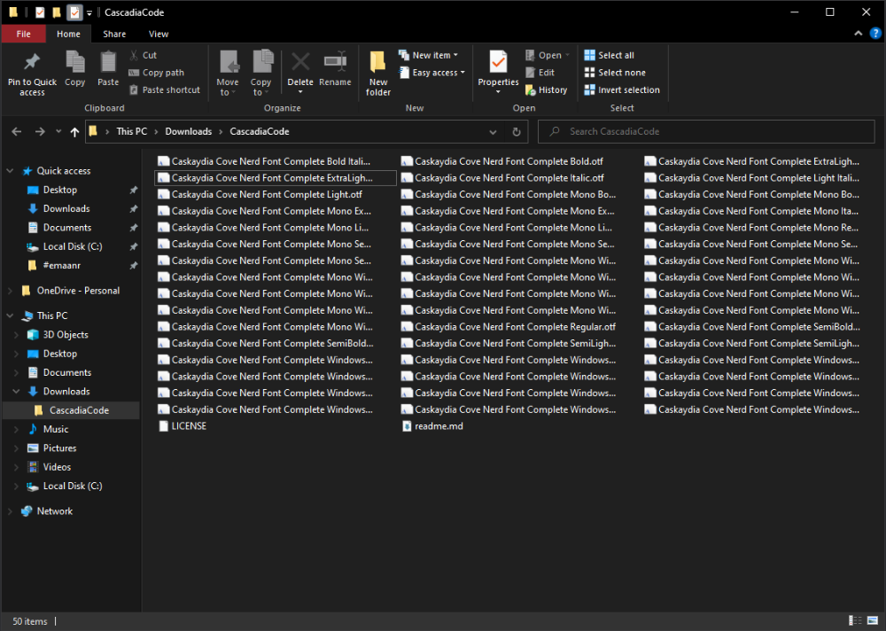

6. Drag and drop the contents of the `Zip Folder` into `Font Settings`.

    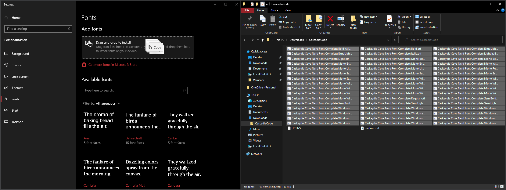

7. The `CaskaydiaCove Nerd Font` should be installed now, this is how you can check.

    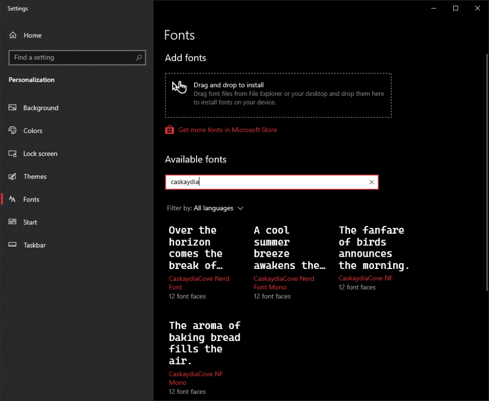

> Notes:
> - Now if you close and reopen `Windows Terminal` the warning should no longer appear.
> - The `Cascadia Code` folder can be deleted now.

# Step 5: Install Oh My Posh

1. Navigate to the [`Oh My Posh`](https://ohmyposh.dev/) website.

    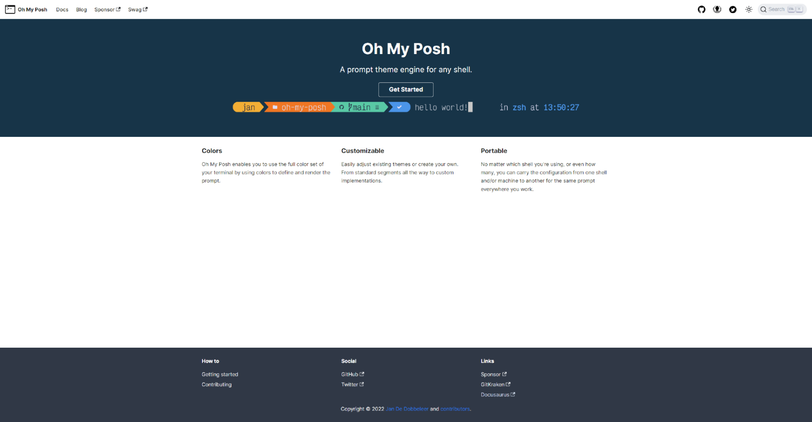

2. Click on `Get Started`.

    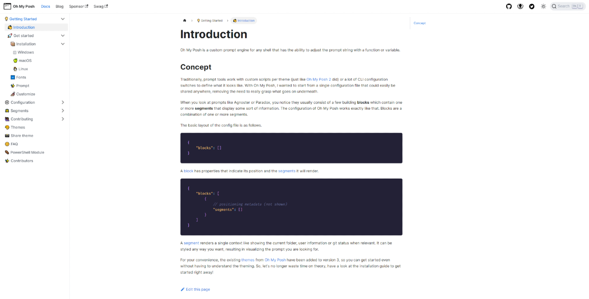

3. Select your operating system in the left sidebar and locate the installation command.

    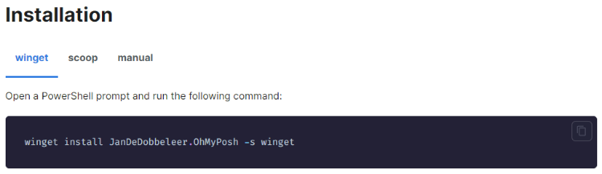

4. Copy and paste the command into `Windows Terminal` to install `Oh My Posh`.

    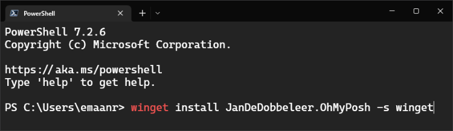

5. Hit `Enter` to install `Oh My Posh`.

    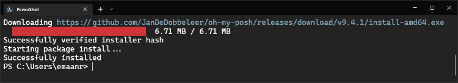

6. Run the following command to ensure there are no upgrades available.

    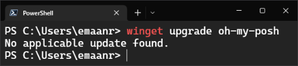

7. Close and reopen `Windows Terminal`, then run the command `oh-my-posh.exe`.

    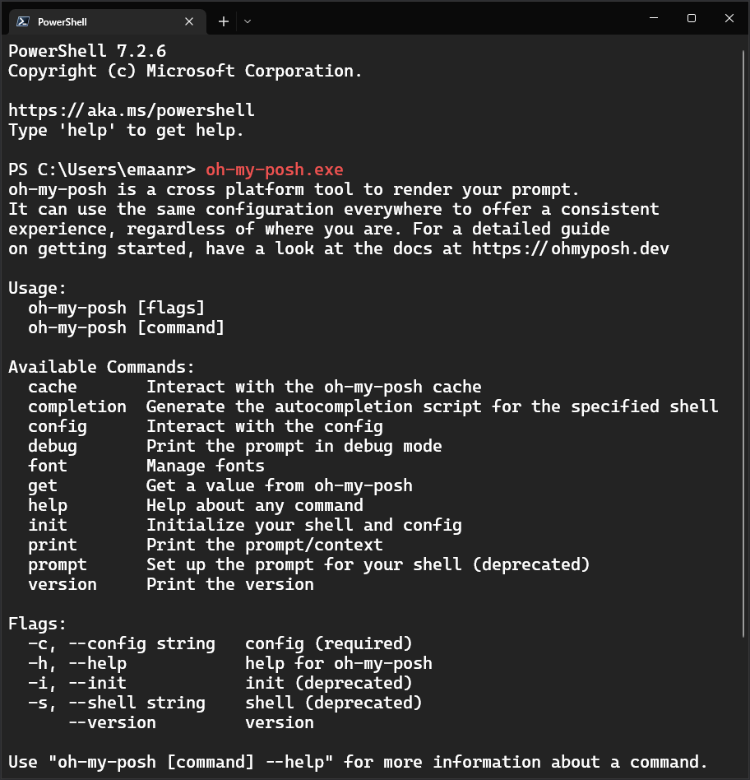

