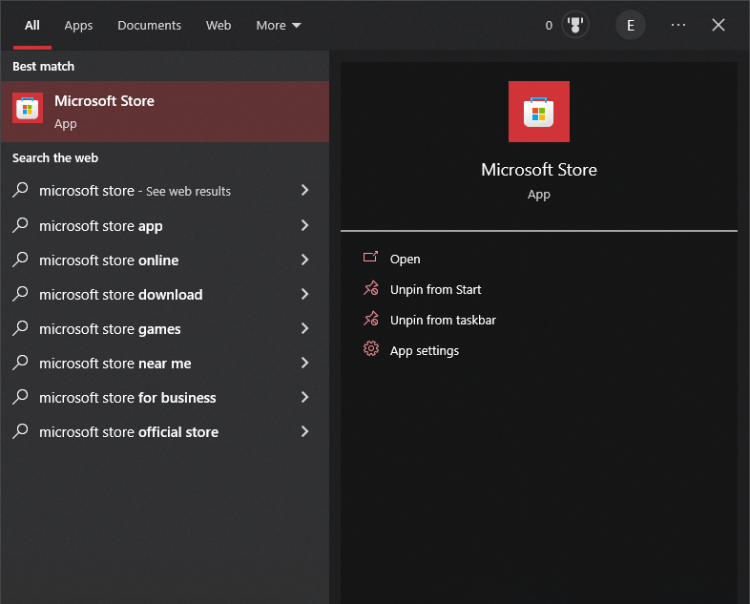

# Terminal

# Table of Contents

- [Terminal](#terminal)
- [Table of Contents](#table-of-contents)
- [Step 1: Install Windows Terminal](#step-1-install-windows-terminal)
- [Step 2: Install PowerShell](#step-2-install-powershell)
- [Step 3: Configure Windows Terminal](#step-3-configure-windows-terminal)

# Step 1: Install Windows Terminal

1. Navigate to the Microsoft Store on a computer with a Windows OS.

    

2. Search for `Windows Terminal` and install.

    

# Step 2: Install PowerShell

1. Navigate to the Microsoft Store on a computer with a Windows OS.

    

2. Search for `PowerShell` and install.

    

# Step 3: Configure Windows Terminal

1. Open `Windows Terminal`.