# Terminal

# Table of Contents

- [Terminal](#terminal)
- [Table of Contents](#table-of-contents)
- [Step 1: Install `Windows Terminal`](#step-1-install-windows-terminal)
- [Step 2: Install `PowerShell`](#step-2-install-powershell)
- [Step 3: Configure `Windows Terminal`](#step-3-configure-windows-terminal)
- [Step 4: Install `NerdFonts`](#step-4-install-nerdfonts)
- [Step 5: Install `Oh My Posh`](#step-5-install-oh-my-posh)
- [Step 6: Set `Oh My Posh` Prompt](#step-6-set-oh-my-posh-prompt)
- [Step 7: Install `Terminal Icons`](#step-7-install-terminal-icons)
- [Step 8: Install `PSReadLine`](#step-8-install-psreadline)
- [Step 9: Configure `VSCode`](#step-9-configure-vscode)

# Step 1: Install `Windows Terminal`

1. Navigate to the `Microsoft Store` on a computer with a Windows OS.

<p align="center" width="100%">
    
</p>

2. Search for `Windows Terminal` and install.

<p align="center" width="100%">
    
</p>

# Step 2: Install `PowerShell`

1. Navigate to the `Microsoft Store` on a computer with a Windows OS.

<p align="center" width="100%">
    
</p>

2. Search for `PowerShell` and install.

<p align="center" width="100%">
    
</p>

# Step 3: Configure `Windows Terminal`

1. Open `Windows Terminal`.

<p align="center" width="100%">
    
</p>

1. Navigate to `Settings`.

<p align="center" width="100%">
    
</p>

3. Set `PowerShell` as the Default Profile.

<p align="center" width="100%">
    
</p>

4. Select the `Settings Cog` in the bottom left hand corner to open the `settings.json` file for `Windows Terminal`.

<p align="center" width="100%">
    
</p>

5. Replace the contents of the `settings.json` opened in the previous step with the repository file contents found at `terminal/Windows Terminal/settings.json`.

6. Configure further as desired.

> Notes:
> - The file in the repository is the final version of the file after all steps are complete.
> - As of this step, `Windows Terminal` will not be able to find the NerdFont `Caskaydia Cove NF` which will throw a warning every time `Windows Terminal` is opened.
>
> <p align="center" width="100%">
>   
> </p>
>
>> More on `Caskaydia Cove NF`:
>> - This font is needed in order for `Oh My Posh` to work correctly (includes some special characters).
>> - If you don't want `Oh My Posh`, simply change the `Caskaydia Cove NF` font to some other font that exists on the machine already.
>> - This can be done in the Windows OS Font Settings.
>> - It seems that `Windows Terminal` defaults to the font `Consolas`.
>
> In order to remove this warning, install `CaskaydiaCove NF` in the next step.

# Step 4: Install `NerdFonts`

1. Navigate to the [`NerdFonts`](https://www.nerdfonts.com) website.

<p align="center" width="100%">
    
</p>

2. Click on [`Download`](https://www.nerdfonts.com/font-downloads) button.

<p align="center" width="100%">
    
</p>

3. Save the `Zip Folder` anywhere (won't need it later).

<p align="center" width="100%">
    
</p>

4. Open `Font Settings`.

<p align="center" width="100%">
    
</p>

5. Extract the zip file and open the `Cascadia Code` folder.

<p align="center" width="100%">
    
</p>

6. Drag and drop the contents of the `Zip Folder` into `Font Settings`.

<p align="center" width="100%">
    
</p>

7. The `CaskaydiaCove Nerd Font` should be installed now, this is how you can check.

<p align="center" width="100%">
    
</p>

> Notes:
> - Now if you close and reopen `Windows Terminal` the warning should no longer appear.
> - The `Cascadia Code` folder can be deleted now.

# Step 5: Install `Oh My Posh`

1. Navigate to the [`Oh My Posh`](https://ohmyposh.dev/) website.

<p align="center" width="100%">
    
</p>

2. Click on `Get Started`.

<p align="center" width="100%">
    
</p>

3. Select your operating system in the left sidebar and locate the installation command.

<p align="center" width="100%">
    
</p>

4. Copy and paste the command into `Windows Terminal` to install `Oh My Posh`.

<p align="center" width="100%">
    
</p>

5. Hit `Enter` to install `Oh My Posh`.

<p align="center" width="100%">
    
</p>

6. Run the following command to ensure there are no upgrades available.

<p align="center" width="100%">
    
</p>

7. Close and reopen `Windows Terminal`, then run the command `oh-my-posh.exe`.

<p align="center" width="100%">
    
</p>

# Step 6: Set `Oh My Posh` Prompt

1. From the `Oh My Posh` Docs page, navigate to the `Prompt` page in the left sidebar.

<p align="center" width="100%">
    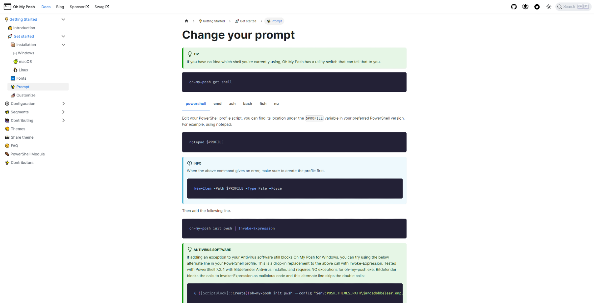
</p>

2. Create a new `PowerShell` profile by inoking the following command in `Windows Terminal`.

<p align="center" width="100%">
    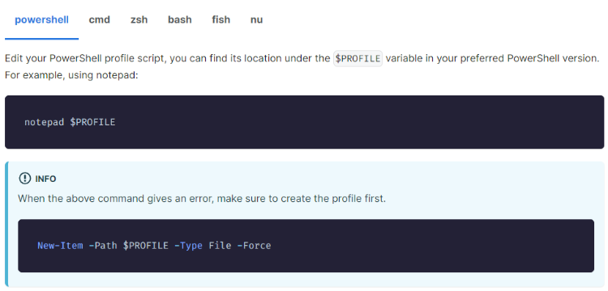
</p>

3. The command should create a `Microsoft.PowerShell_profile.ps1` file.

<p align="center" width="100%">
    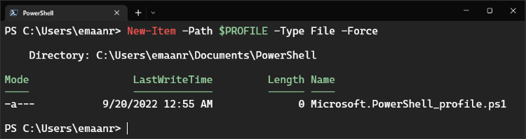
</p>

4. Replace the contents of the `Microsoft.PowerShell_profile.ps1` file created in the previous step with the repository file contents found at `terminal/PowerShell/
Microsoft.PowerShell_profile.ps1`.

5. Close and reopen `Windows Terminal`.

<p align="center" width="100%">
    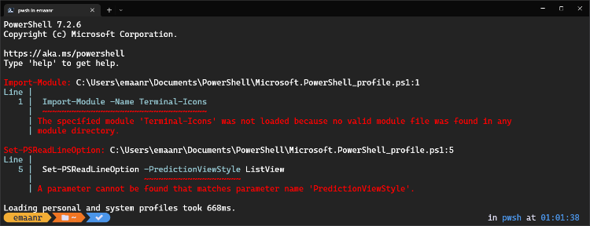
</p>

> Notes:
> - The Terminal will throw some errors since some modules in the profile have not been installed yet.
> - However, at this point, the default `Oh My Posh` prompt should display.

6. Download the respository file located at `terminal/Oh My Posh/magnetfrog.omp.json` and store it in the `C:\Users\emaanr\AppData\Local\oh-my-posh` file path location on local machine so the `Microsoft.PowerShell_profile.ps1` can locate it.

<p align="center" width="100%">
    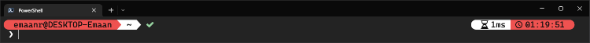
</p>

> Notes:
> - Realistically, the file can be stored anywhere as long as you set the path to it properly in the `Microsoft.PowerShell_profile.ps1` file.
> - I stored the theme `.omp.json` file at `C:\Users\emaanr\AppData\Local\oh-my-posh` to keep things organized since this is where the default theme is located.
> - To look at more themes to use or refer to when configuring your own, see [`Themes`](https://ohmyposh.dev/docs/themes) in the `Oh My Posh` Docs.

# Step 7: Install `Terminal Icons`

1. Navigate to the [`Terminal Icons`](https://github.com/devblackops/Terminal-Icons) Repository on GitHub by devblackops.

<p align="center" width="100%">
    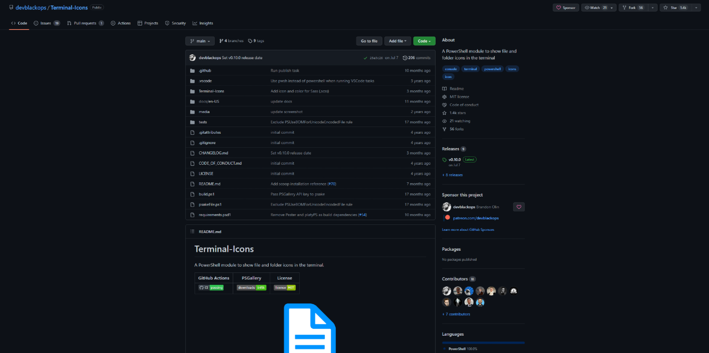
</p>

2. Scroll to the `Installation` portion of the README.md and copy paste the `Install-Module` command into `PowerShell` via `Windows Terminal`.

<p align="center" width="100%">
    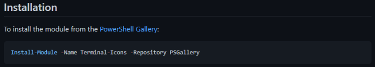
</p>

3. Invoking the command should result in the following.

<p align="center" width="100%">
    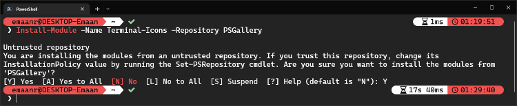
</p>

4. Close and reopen `Windows Terminal` to reload the `PowerShell` profile.

<p align="center" width="100%">
    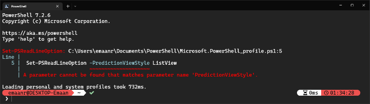
</p>

> Note:
> - One of the errors is no longer being thrown because we have installed that module.

5. Now if we enter the `ls` command, `Terminal Icons` are present.

<p align="center" width="100%">
    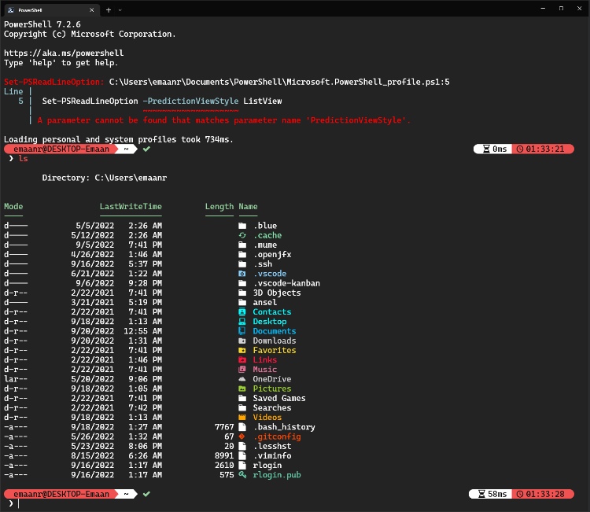
</p>

# Step 8: Install `PSReadLine`

1. Navigate to the [`PSReadLine`](https://learn.microsoft.com/en-us/powershell/module/psreadline/about/about_psreadline?view=powershell-7.2) page of the `Microsoft` Docs.

<p align="center" width="100%">
    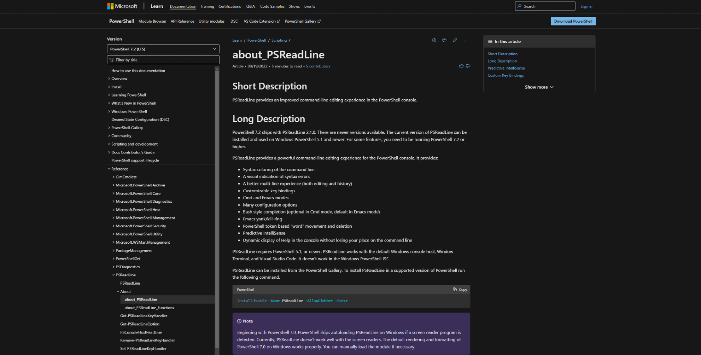
</p>

2. Invoke the following `Install-Module` command.

<p align="center" width="100%">
    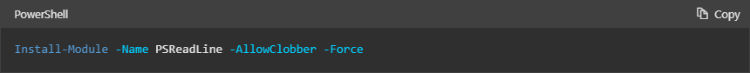
</p>

3. After installing the module, when `l` is entered, `s` is suggested.

<p align="center" width="100%">
    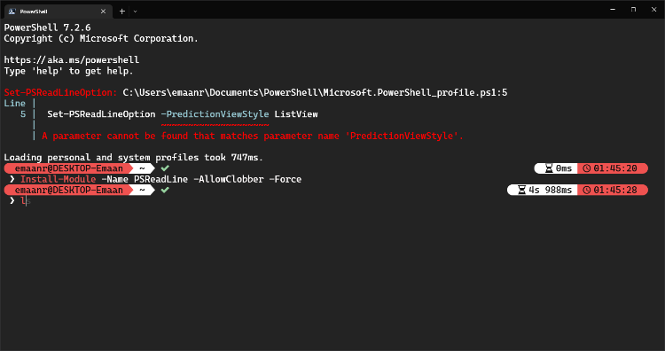
</p>

4. Closing and reopening `Windows Terminal` to reload the `PowerShell` profile no longer throws any errors now.

<p align="center" width="100%">
    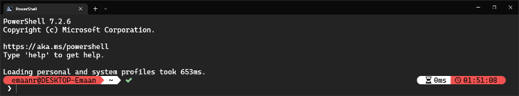
</p>

# Step 9: Configure `VSCode`

> Optional:
> - The Terminal is all set up now, but if you want `Oh My Posh` to show up in the VSCode Terminal as well, there are some additional configurations that can be made.

1. Simply add the following line to the `VSCode` `User Settings (JSON)` `settings.json` file found at the file path `C:\Users\emaanr\AppData\Roaming\Code\User`.

    ```
    "terminal.integrated.fontFamily": "CaskaydiaCove NF"
    ```

2. If successful, the `VScode` terminal should look like the following.

<p align="center" width="100%">
    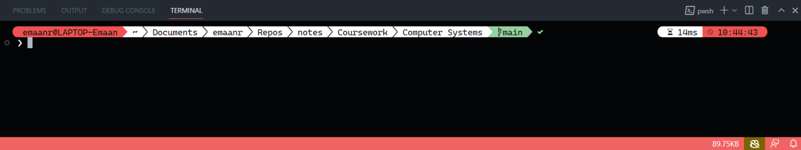
</p>